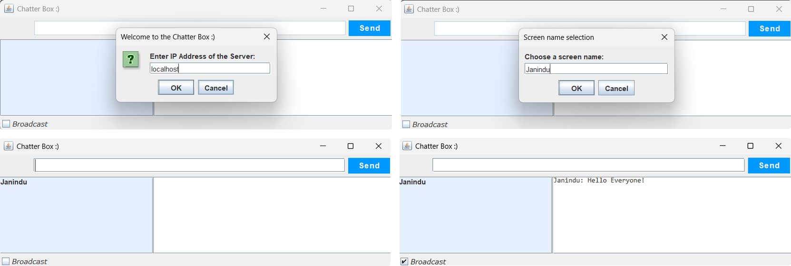

# ChatSphere

ChatSphere is a real-time, multi-user chat application that allows users to communicate seamlessly in a shared space. It supports both broadcast messaging (sending messages to all users) and private messaging (sending messages to specific users). The application is built with a focus on simplicity, scalability, and real-time interaction.

### 🤖 Key Features:

- Real-Time Messaging: Instant message delivery between users.
- Unique Usernames: Ensures no two users have the same name.
- Broadcast and Private Messaging:
- Send messages to all connected users.
- Send private messages to specific users.
- Dynamic Client List: Displays all connected users in real-time.
- User-Friendly GUI: Built with Java Swing for an intuitive user experience.
- Multi-Threaded Server: Handles multiple clients simultaneously.

### ⚙️ Tech Stack:
  
#### Backend:
- Java (Core Java)
- Java Sockets (for network communication)
- Multi-threading (to handle multiple clients)

#### Frontend:
- Java Swing (for the GUI)

#### Build Tool:
- Maven or Gradle (for dependency management and building the project)
